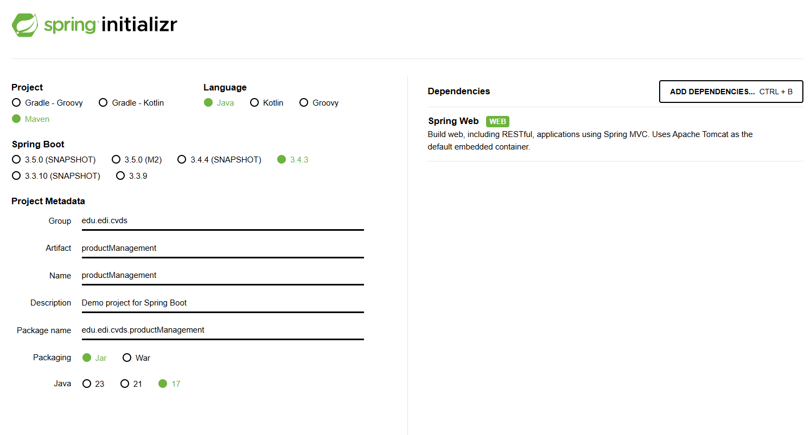
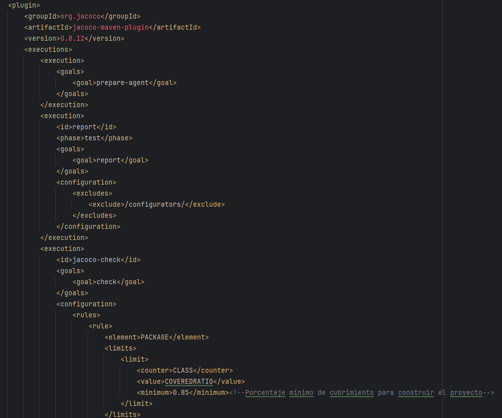
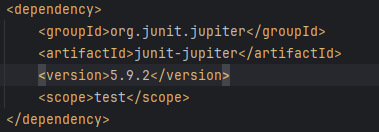
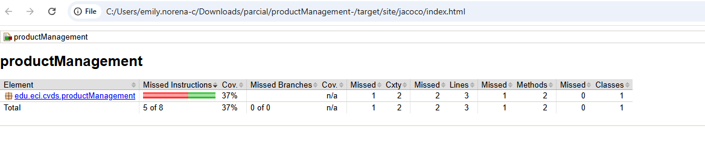
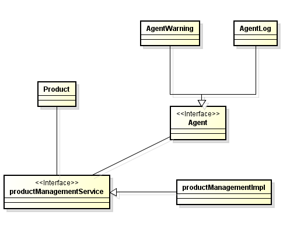
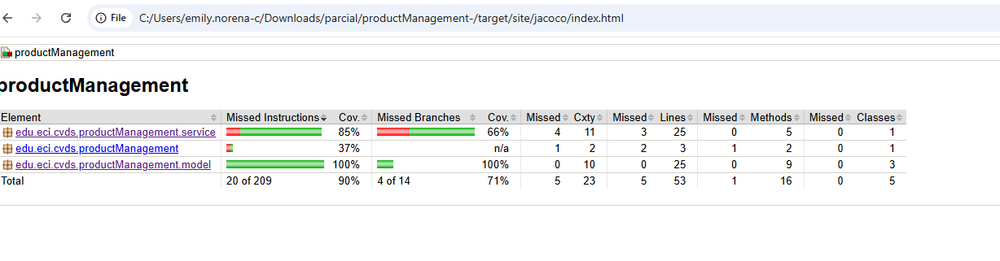

# productManagement

## Parcial primer corte CVDS

1. Crear repositorio configurado con Maven y SpringBoot.
   

      
   

2. Configurar Jacoco y JUnit
   

      
   

   

      
   

   

      
   

3. Patrón de diseño
   El patrón de diseño que se implementó fue el Observer, con este, es posible que cada vez que se actualiza la clase con la informació, esta se llame a las clases que necesitan estos datos.
4. Construcción de las clases
    

      
   

   Siguiendo los princcipios SOLID, usamos el principio de Inversión de Dependencias para la clase principal productManagementService, donde contamos con una interfaz encargada de qué es lo que se hace y la clase implementación que es la encargada de la lógica y el cómo se hace. 
6. Cobertura Jacoco
   

      
   

